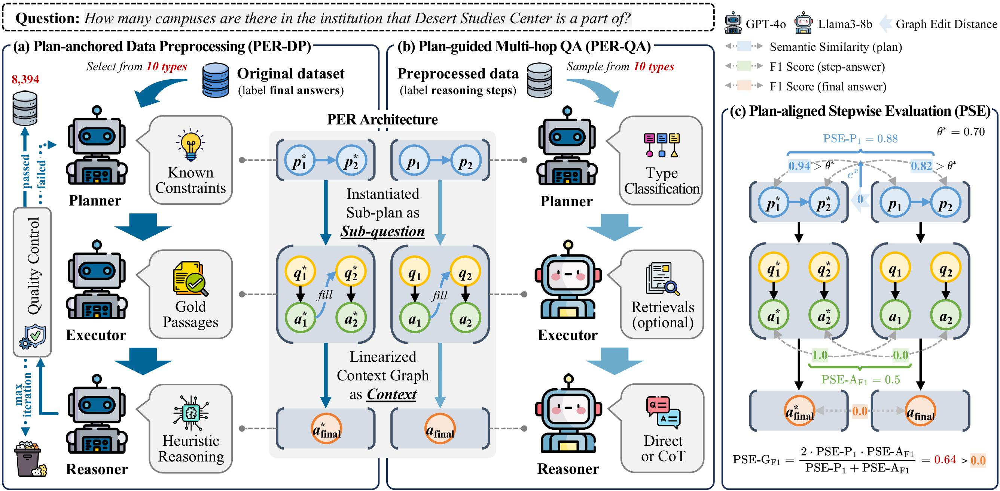

# Beyond the Answer: Advancing Multi-Hop QA with Fine-Grained Graph Reasoning and Evaluation

\[ English | [中文](README_zh.md) \]

<div align="center"> 

[]() [](https://github.com/GenIRAG/PER-PSE/blob/main/LICENSE) [](https://www.python.org/downloads/release/python-3112/) 
</div>

## ✨ Overview
<p align="center">


</p>

Recent advancements in large language models (LLMs) have significantly improved the performance of multi-hop question answering (MHQA) systems. Despite the success of MHQA systems, the evaluation of MHQA is not deeply investigated. Existing evaluations mainly focus on comparing the final answers of the reasoning method and given ground-truths. We argue that the reasoning process should also be evaluated because wrong reasoning process can also lead to the correct final answers. Motivated by this, we propose a "<u>**P**</u>lanner-<u>**E**</u>xecutor-<u>**R**</u>easoner" (PER) architecture, which forms the core of the Plan-anchored Data Preprocessing (PER-DP) and the Plan-guided Multi-Hop QA (PER-QA). The former provides the ground-truth of intermediate reasoning steps and final answers, and the latter offers them of a reasoning method. Moreover, we design a fine-grained evaluation metric called <u>**P**</u>lan-aligned <u>**S**</u>tepwise <u>**E**</u>valuation (PSE), which evaluates the intermediate reasoning steps from two aspects: planning and solving. Extensive experiments on ten types of questions demonstrate competitive reasoning performance, improved explainability of the MHQA system, and uncover issues such as "fortuitous reasoning continuance" and "latent reasoning suspension" in RAG-based MHQA systems. Besides, we also demonstrate the potential of our approach in data contamination scenarios. 

## 📦 Environment

``` pip
pip install -r requirement.txt
```

## 🗄️ Data
We release MHQA datasets processed by PRE-DP, including HotpotQA, 2WikiMultihopQA, and MuSiQue, 8,394 questions in total. The data can be obtained from [Huggingface Datasets](https://huggingface.co/datasets/GenIRAG/PER-PSE).

**Dataset Format:**
```jsonl
{
    "id": "Question Identifier",
    "question": "Question",
    "golden_answers": [
        "Golden Answer 1", 
        ...
    ],

    "metadata":{
        "_id": "Question Identifier in Original Datasets",
        "type": "Type of Question，'bridge' or 'compositional' ",
        "hop": "Count of hops, e.g., '2hop' ",
        "plan": {
            // Plan After Decomposition
            "Q1": [
                "Sub-question 1",
                "Placeholder 1, e.g., '<A1>' "
            ],
            ...
        },
        "graph": [
            // Instantiated Graph of the Question After Decomposition
            {
                "Q1": {
                    "template": "Template of Sub-question (w/ placeholders)",
                    "previous": ["Dependency Sub-question 1", ...],
                    "query": "Instantiated Sub-question (w/o placeholders)",
                    "supports": [
                        // Golden Passages
                        {
                            "title": "Title",
                            "contents": [
                                "Passage Content",
                                ...
                            ]
                        }
                    ],
                    "tag": Placeholder,
                    "answer": Answer of Sub-question
                },
                ...
            }
        ]
    }
}
```
Datasets are stored in `jsonl` format. The field `metadata` is fine-grained intermediate steps provided by PER-DP.

**Custom Datasets:**

You can organize your custom dataset in the format provided by `jsonl` and configure the relevant parameters (see below). After that, PER-PSE will read, run and produce results in this format. 

## 🚀 Run

This project is forked and modified from the open source project [FlashRAG](https://github.com/RUC-NLPIR/FlashRAG). To run this project: 

1. Add relevant parameters (your model path or api key, etc.) in `flashrag/config/basic_config.yaml`; 

2. Refer to the original FlashRAG repository to download the BM25 index and put it into `indexes`. Put your data under `datasets`. 

3. Configure the running parameters in `run.py`: 
- Set you data storage path in the parameter `data_dir`; 
- Set the model you want to use in the parameter `GENERATOR_MODELS`; 
- Set the dataset you want to run in the parameter `DATASET_NAMES`; 
- Select the method you want to run in parameter `FUNC_DICT`; 
- Set other parameters under the main method (such as the log storage path).  

4. Run `run.py`. 

## 🔖 License
This project is licensed under the [MIT License](LICENSE).

## 🔭 Citation
If you find this work helpful, please cite our paper:
```bibtex
Coming Soon
```
